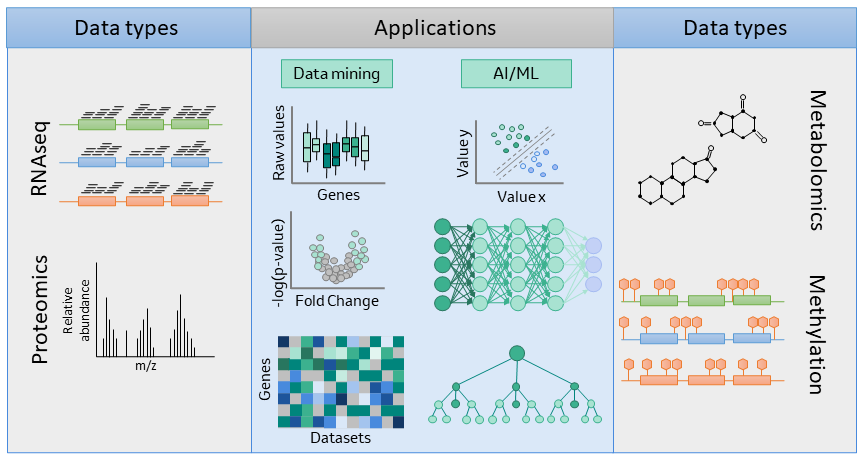
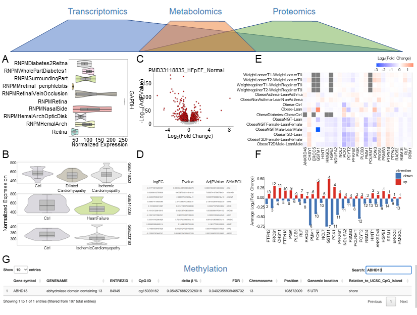

# MultiOmicsDataCompile

`MultiOmicsDataCompile` provides batch-processing workflows for public
transcriptomic and proteomic data, tools for integrating differential and raw
expression data, and a Shiny application for brief multi-omics exploration.
The bundled example database focuses on cardiometabolic disease and includes
transcriptomic, proteomic, methylation, and metabolomic datasets.

## Installation

Install the package and its dependencies from GitHub:

```r
if (!requireNamespace("BiocManager", quietly = TRUE)) {
  install.packages("BiocManager")
}

BiocManager::install(
  "brendangongol/MultiOmicsDataCompile",
  dependencies = TRUE
)
```

Load the package with its new package name:

```r
library(MultiOmicsDataCompile)
```

## Set up the processing workspace

Choose a writable directory, copy the packaged resources, and configure the
copied scripts:

```r
library(MultiOmicsDataCompile)

home_dir <- "path/to/MultiOmicsDataCompileAnalysis"
makeDirectory(home_dir)
AppSetup(home_dir)
```

The configured processing driver is
`Scripts/WorkflowScript.R` beneath `home_dir`. Review its dataset selections and
then run it from that directory. Several stages download large public datasets
and should be run deliberately rather than during package installation.

The extended workflow is available in the bundled vignette source:

```r
file.show(system.file(
  "extdata",
  "vignette",
  "MultiOmicsDataCompileVignette.Rmd",
  package = "MultiOmicsDataCompile"
))
```

## Scope

The workflow covers:

- GEO microarray and RNA-seq download, harmonization, and two-group analysis;
- ProteomeXchange download and dataset-specific MaxQuant formatting;
- construction of integrated `SummarizedExperiment` databases;
- missing-value filtering, normalization, imputation, and differential protein
  abundance analysis; and
- lightweight exploration with tables, violin plots, volcano plots, heatmaps,
  and cross-dataset summaries.





## Development status

The package is under active development. Proteomics source files vary widely in
format, so `FormatMaxQuant()` currently contains dataset-specific parsers and
new repositories may require an additional parser. Review generated quality
control outputs before adding processed data to a production database.
